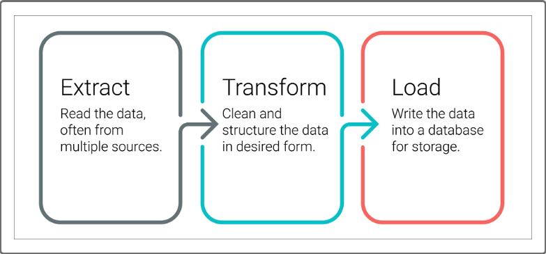

# Movies-ETL

## Background
Amazing Prime Video is a platform for screening movies and TV shows on Amazing Prime which is the world's largest online retailer.  The goal is to write an algorithm to determine the which movies will become popular so they could buy the streaming rights at a bargain.  The data sources are Wikipedia data from all movies released since 1990 and ratings data from the Kaggle.  The goal is to extract the date from those datasets, transform them and load into PostgreSQL, a process known as ETL (Extract - Transform - Load).  The data is in JSON format and two large CSV files.  The data has been successfully extracted, cleaned and loaded into PostgreSQL using Python and Pandas.  Amazing Prime wants to keep the dataset and would like to keep it updated on a daily basis. The challenge is to use the existing ETL code and create an automated pipeline that takes in new data, performs the appropriate transformations, and loads the data into existing tables.

## Approach

The original ETL code has been refactored into functions to enable automation.  The exploratory parts of the code have been removed and simplified as a first step.  After that, The code has been converted to 4 functions to Extract and Transform, a 5th function to export to SQL and a 6th function to run all the 5 functions.  The 6 functions are:

*  Extract and transform from Wikipedia JSON file
*  Extract and transform from Kaggle
*  Extract and transform from Ratings
*  Merge the files into a single dataset
*  Export function to remove date from the PostgreSQL tables and export the data
*  A final function that combines all the 5 functions into one

# Assumptions
The assumptions made for the automation of the ETL from the datasets are as follows:

* a) The data only comes from these three datasets and no other dataset will be incorporated in the future
* b) The transformation assumes certain forms of data and limits it to only those which have been able to identify during the exploratory phase
* c) No bad data during loading or while exporting to SQL
* d) Dropping of redundant information may have resulted in good data lost but the assumption is that redundant data may not be needed
* e) Argument for handling budget values have been limited (some do not have numeric values, some in different currencies
